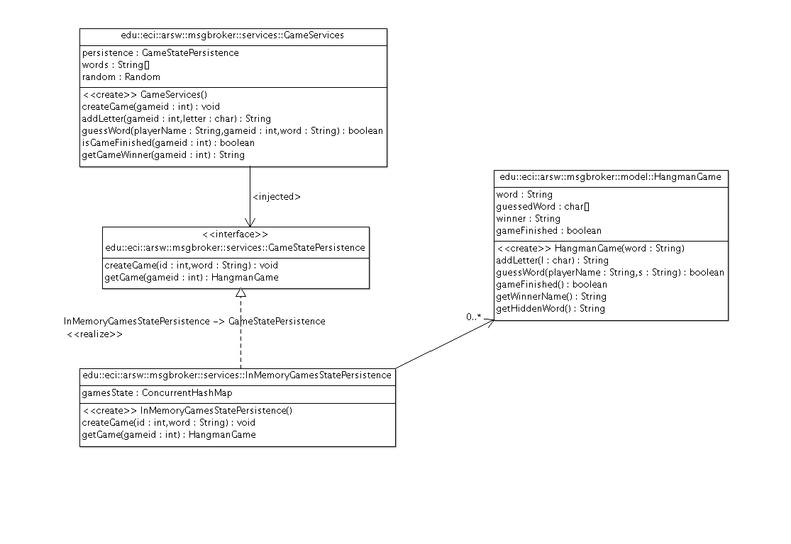

### Escuela Colombiana de Ingeniería
### Arquitecturas de Software - ARSW
## Ejercicio - Cachés y Bases de datos NoSQL

En este ejercicio se va a retomar la aplicación del 'ahorcado en línea', el cual ya está implementado usando una base de datos en memoria. 



En este ejericicio, se realizará un primer paso para hacer escalable esta aplicación, ya que la misma no funcionaría bien al ser replicada y montada bajo un esquema de balanceo de carga (por mantener el estado de las partidas en cada instancia del servidor). Por esta razón, usted hara una nueva implementación de GameStatePersistence: REDISGameStatePersistence.

## Parte I

1. Inicie la máquina virtual Ubuntu trabajada anteriormente, e instale el servidor REDIS [siguiendo estas instrucciones](https://www.digitalocean.com/community/tutorials/how-to-install-and-use-redis), sólo hasta 'sudo make install'. Con esto, puede iniciar el servidor con 'redis-server'. Nota: para poder hacer 'copy/paste' en la terminal (la de virtualbox no lo permite), haga una conexión ssh desde la máquina real hacia la virtual.
        
2. Revise [en la documentación de REDIS](http://redis.io/topics/data-types) el tipo de dato HASH, y la manera como se agregan tablas hash a una determianda llave. Con esto presente, inicie un cliente redis (redis-cli) en su máquina virtual, y cree varias llaves, cada una asociada a cuatro tuplas (llave-valor) correspondientes: la palabra a adivinar, lo que se ha adivinado de la palabra hasta ahora, el ganador, y si la partida ha finalizado. Use como llave de los HASH una cadena compuesta, que incluya el identificador de la partida, por ejemplo: "partida:12345", "partida:9999", etc.    

3. Agregue las dependencias requeridas para usar Jedis, un cliente Java para REDIS:

	```xml
        <dependency>
            <groupId>redis.clients</groupId>
            <artifactId>jedis</artifactId>
        </dependency>

        <dependency>
            <groupId>org.apache.logging.log4j</groupId>
            <artifactId>log4j-core</artifactId>
        </dependency>

        <dependency>
            <groupId>org.slf4j</groupId>
            <artifactId>slf4j-api</artifactId>
        </dependency>
 	```                               


4. Copie la siguiente clase y archivo de configuración (en las rutas respectivas) dentro de su proyecto (éstas ya tiene la configuración para manejar un pool de conexiones al REDIS):

	* [https://github.com/hcadavid/jedis-examples/blob/master/src/main/java/util/JedisUtil.java](https://github.com/hcadavid/jedis-examples/blob/master/src/main/java/util/JedisUtil.java)
	* [https://github.com/hcadavid/jedis-examples/blob/master/src/main/resources/jedis.properties](https://github.com/hcadavid/jedis-examples/blob/master/src/main/resources/jedis.properties)
   


## Parte II

Revise cómo [usar Jedis para realizar operaciones con HASH (HMGET) de REDIS](https://xicojunior.wordpress.com/2013/08/09/using-redis-hash-with-jedis/). A partir de esto, haga la nueva implemenación de GameStatePersistence (REDISGameStatePersistence), teniendo en cuenta que cada operación con Jedis se inicia obteniendo una de las conexiones del pool de conexiones, y se finaliza liberando dicha conexión:

```java

Jedis jedis = JedisUtil.getPool().getResource();
	    
	//Operaciones	    
	    
jedis.close();
	    
```


1. Implemente el método getGame, de manera que éste consulte los datos actuales de la partida indicada en REDIS, y a partir de los mismos cree y retorne una instancia de HangmanGame.

2. Implemente el método addLetter, teniendo en cuenta que el mismo debería:
    
	1. Reconstruir la versión actual de HangmanGame
	2. Agregarle la letra al HangmanGame
	3. Obtener del objeto HangmanGame la nueva versión de la palabra que se ha adivinado hasta ahora (es decir, la palabra con nuevas letras descubiertas), y actualizar esto el HASH de REDIS.


6. Implemente el método checkWordAndUpdateHangman, de manera que éste valide la palabra, y en caso de que sea la esparada, actualice el estado del juego en REDIS: 
 	
	1. Reconstruir la versión actual de HangmanGame.
	2. A través del método 'guessWord' de HangmanGame, veririficar si la palabra fue adivinada correctamente.
	3. Si fue adivinada correctamente, actualizar el nombre del ganador y cambiar el estado del juego a finalizado.
	4. Retornar verdadero o falso, según corresponda.


8. Ajuste la configuración de la aplicación para que a la lógica, en lugar de inyectársele la persistencia en memoria, se le inyecte la persistencia basad en REDIS.

9. Ejecute la aplicación en su máquina virtual, y verifique el funcionamiento de la misma (1) en el navegador, y (2) consultando las entradas de tipo HASH creadas incialmente mediante el cliente de REDIS.

10. Agregue unas nuevas partidas a REDIS (igual que en la parte I), pero poniéndole a éstas un [tiempo de expiración corto](http://www.redis.io/commands/expire) (por ejemplo 1 minuto). Pruebe de nuevo el funcionamiento de la aplicación. Qué ocurre en este caso?

### Parte III. 

7. El método checkWordAndUpdateHangman realiza DOS operaciones en REDIS. Se quiere (1) que las dos se realicen atómicamente, y (2) que se garantice que si al momento de realizar la transacción el valor fue cambiado (respecto al que había al inicio de la transacción), la operación no sea realizada. Para esto, [revise el manejo de transacciones con WATCH y MULTI](https://github.com/xetorthio/jedis/wiki/AdvancedUsage).  

### Parte IV - Para el Martes, Impreso. 


Actualizar (y corregir) el diagrama realizado en el laboratorio anterior.
